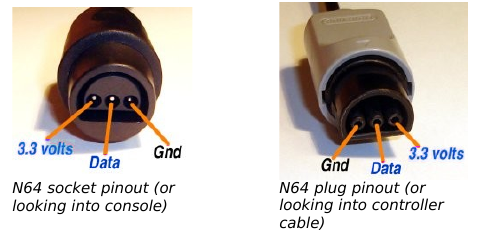
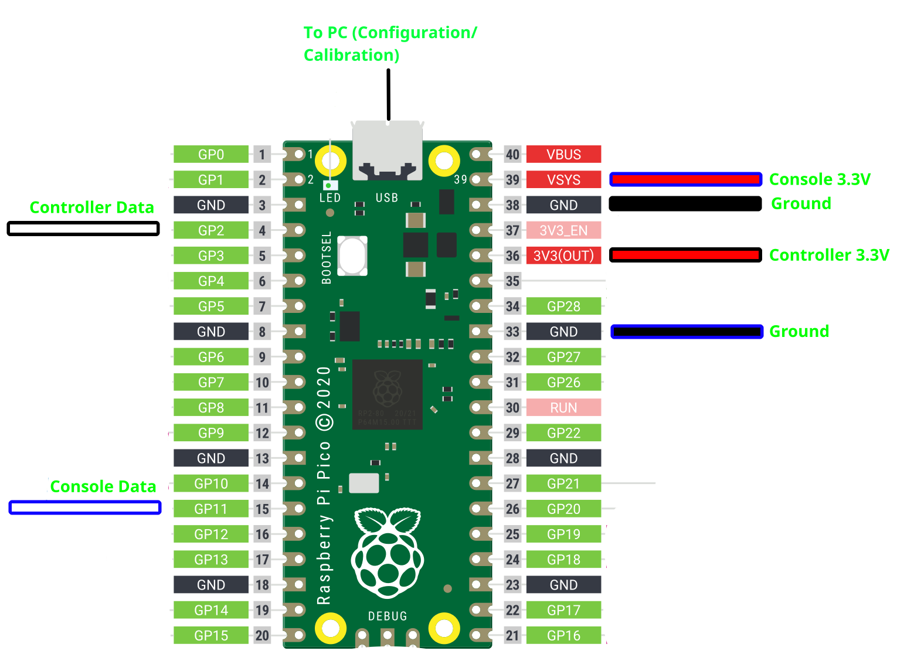
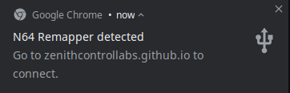

# N64 Remapper

The Zenith Control Labs N64 Remapper is a device that essentially lets you calibrate and adjust any N64 controller. It is an adapter that you plug into your console and plug your controller into, based on the Rasperry Pi Pico hardware. 

This documentation will walk you through building yourself one and how to set it up. Some amount of electronics knowledge is assumed.

If you have one that is pre-assembled and pre-flashed, skip to [Using](#using).

# Building

## Requirements

- 1x Raspberry Pi Pico
    - Any other Raspberry Pi will **NOT** work. A pico is a microcontroller, other Pis are single board computers.
- N64 controller receptacle (female port), or some way of plugging in your controller into the Pico's GPIO pins. 
    - The cables within something like an Input Display work for this.
- An N64 controller cable (male port), or some way of plugging the Pico into your console.
    - You can hack up an old controller for this, if again you do not have the cables
- A USB Micro cable (for plugging in the Pico)

## Connecting

If you don't already know, the N64 controller has 3 pins: 3.3V, Ground, and Data, as shown in the picture below ([credit](https://hackaday.io/project/180539/instructions)):

Then, the below diagram shows the connections between your console, controler, and the Pico:

Couple notes:

- Ground is interchangable. Use whatever the most convenient ground port on the Pico as labeled in this diagram is.
- Note that Controller Data is on **GP2** (GPIO Port 2), not port 2 of the Pico (which is labeled, and on a different port, GP1).

TODO: Not a part of the guide, but for those reading that are knowledgable, should there be a pullup between Console Data & Console 3.3V? I'm unsure of this. Please let me know in the Discord.

## Flashing 

For now, leave the console connection unplugged. The Pico does not need to be powered by the console, since you will flash and configure it using your PC (USB-powered.)
However, do leave your controller plugged in.

Hold the white BOOTSEL button on the Pico while plugging in the USB to your computer. You will see a flash drive pop up. Drag and drop a UF2 file from the [Releases](https://github.com/ZenithControlLabs/N64_Remapper/releases) page (if in doubt, just use the latest) onto the flash drive.

# Using

Make sure you're using Chrome as your browser for the following sections. Other browsers do not support WebUSB + WebHID well.

## Linux sidenote

If you're on Linux, install the [udev rules](doc/10-zcl.rules) in this repo to `/etc/udev/rules.d`. Run `sudo udevadm control --reload` and replug.

## Open config tool

Once you've flashed the Pico, with the USB and your controller still plugged in,  you should see a popup from Chrome indicating the controller was connected. Click on it.

(Of course, Chrome has to be open for this to pop up.)

If it doesn't pop up, follow [Troubleshooting](#troubleshooting). Otherwise, you should see the web config tool pop up. If everything is working normally, you should see the green dot moving around as you move the stick, but not the black & white circle. To get the circle to move, you need to calibrate the controller.

## Calibration

To calibrate, hit "Start Calibration" in the config tool and move the stick around the gate to the point instructed by the white circle. So, if the circle is in the center, let go of the stick. If it's in up right notch, move the stick to up right notch. After each step hit "Next step", until you've reached the end of the sequence. Then you should see the black & white circle move.

Some tips for a good calibration:

* Don't press super hard, or super light when moving into the notches. Press however hard you normally would when you move the stick into the notches.

* Don't let go immediately after hitting next step. There is some delay between you hitting the button and the stick signal being collected, so doing this risks collecting bad data from after you hit the button.

Once you're satisfied with the values from your calibration, make sure to hit "Save Settings" so it persists. You can now plug in the remapper to the console and it *should* work. Unplug the USB when you do this.

## Troubleshooting

There is a good chance it will not work. I have not tested this on a wide range of controllers. There also might be some finnicky behavior with replugging controllers/initializing them. Some things to try:

* If you just didn't see the popup from earlier, check in Device Manager (Windows)/lsusb (Linux) that you see the N64 Remapper device. If you don't see it, it hasn't succesfully initialized controller comms. Keep going down the list
    * If it's there, just open the link from earlier anyway: https://zenithcontrollabs.github.io/N64_Remapper_GUI/
* Try replugging the USB
* Try replugging your controller
* Verify your pinout from earlier
* If it was working in USB, but not on the console, let make a post in #user-tech-support in the Discord indicating this
* Anything else, just make a post in #user-tech-support in the Discord
